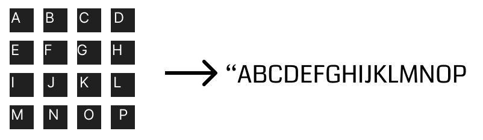

# Pixel to Text

This a simple experiment "kinda" of an image to text generator

using 4x4 characters

## How it works

It takes a simple text data describing the 4x4 image, in the basic form, a-p



Say,
```
A   C 
E F 
I   K
M   O
```
This is kinda like a "K"...
 This will become `"acefikmo"`

And then this will be stored as the only representative of "k"
And to anything be taken as a "k" it must be at least 80% identical

Now, For example,
```python
# Import the logic
import pixel_to_text as p2t

char_c_block = p2t.splitize("abcdeimnop") # C (block)
char_c_curve = p2t.splitize("bcdeinop") # C (curve)
char_k_norma = p2t.splitize("acefikmo") # k

print(p2t.match_value(char_c_block, char_c_curve)) # >>> 0.8944271909999159
print(p2t.match_value(char_c_block, char_k_norma)) # >>> 0.6708203932499368
```
